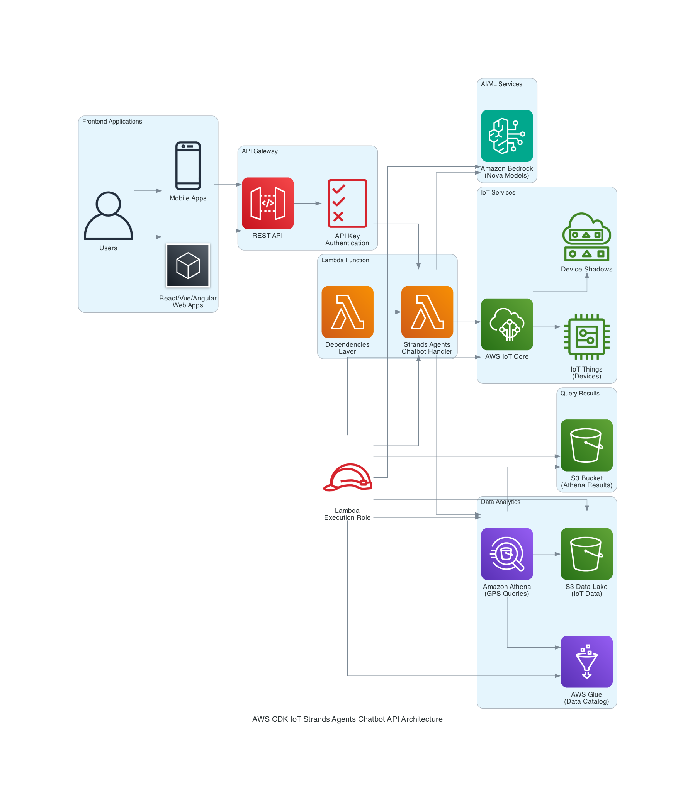

# AWS CDK IoT Strands Agents Chatbot API

## Introduction

This is a TypeScript-based CDK (Cloud Development Kit) example that demonstrates how to deploy a Python-based Strands Agents Chatbot as a REST API endpoint for IoT device management. The deployment creates an intelligent IoT assistant chatbot powered by Strands Agents that can interact with AWS IoT Core, analyze connected devices, and provide insights about your IoT infrastructure through natural language conversations.

**The API is specifically designed for frontend integration** - perfect for React applications, Vue.js, Angular, or any web framework that needs to provide conversational IoT device management capabilities to users.

## Architecture



The architecture demonstrates a comprehensive IoT management solution with the following key components:

### 🏗️ **Architecture Overview**

- **Frontend Layer**: Web applications (React, Vue, Angular) and mobile apps that provide user interfaces for IoT device management
- **API Gateway**: Secure REST API endpoint with API key authentication for controlling access to the chatbot
- **Lambda Function**: Python-based Strands Agents chatbot handler with a separate dependencies layer for optimized deployment
- **AI/ML Integration**: Amazon Bedrock with Nova models providing intelligent conversational capabilities
- **IoT Services**: Direct integration with AWS IoT Core for device management, including device registry and shadow states
- **Data Analytics**: Amazon Athena for querying historical IoT data stored in S3 data lakes, with AWS Glue for data cataloging
- **Security**: IAM roles and policies ensuring least-privilege access across all services

### 🔄 **Data Flow**

1. **User Interaction**: Users interact through web or mobile applications
2. **API Authentication**: Requests are authenticated via API Gateway using API keys
3. **Intelligent Processing**: Lambda function processes requests using Strands Agents framework
4. **AI-Powered Responses**: Amazon Bedrock (Nova models) generates intelligent responses
5. **IoT Data Retrieval**: Real-time device data fetched from AWS IoT Core
6. **Historical Analysis**: Complex queries executed via Amazon Athena on S3 data lakes
7. **Contextual Responses**: Comprehensive responses combining real-time and historical data

## Prerequisites

- [AWS CLI](https://aws.amazon.com/cli/) installed and configured
- [Node.js](https://nodejs.org/) (v18.x or later)
- Python 3.12 or later
- [jq](https://stedolan.github.io/jq/) (optional) for formatting JSON output

## Project Structure

- `lib/` - Contains the CDK stack definition in TypeScript
- `bin/` - Contains the CDK app entry point and deployment scripts:
  - `cdk-app.ts` - Main CDK application entry point
  - `package_for_lambda.py` - Python script that packages Lambda code and dependencies into deployment archives
- `lambda/` - Contains the Python Lambda function code
- `packaging/` - Directory used to store Lambda deployment assets and dependencies

## Setup and Deployment

1. Install dependencies:

```bash
# Install Node.js dependencies including CDK and TypeScript locally
npm install

# Create a Python virtual environment (optional but recommended)
python -m venv .venv
source .venv/bin/activate  # On Windows: .venv\Scripts\activate

# Install Python dependencies for the local development
pip install -r requirements.txt
# Install Python dependencies for lambda with correct architecture
pip install -r requirements.txt --python-version 3.12 --platform manylinux2014_aarch64 --target ./packaging/_dependencies --only-binary=:all:
```

2. Package the lambda:

```bash
python ./bin/package_for_lambda.py
```

3. Bootstrap your AWS environment (if not already done):

```bash
npx cdk bootstrap
```

4. Deploy the lambda:

```
npx cdk deploy
```

## Strands Agents IoT Capabilities

This deployment showcases the power of **Strands Agents** for IoT device management. The chatbot agent is equipped with specialized tools that enable:

### 🔧 **IoT Device Management**
- **Device Discovery**: Automatically retrieve all IoT Things from AWS IoT Core
- **Device Type Analysis**: Understand different IoT device categories and their purposes
- **Connectivity Monitoring**: Track which devices are currently connected and their last seen timestamps
- **Device Filtering**: Query specific device types (vehicles, sensors, smart home devices, etc.)

### 📍 **Location Intelligence**
- **GPS Tracking**: Retrieve real-time GPS coordinates for vehicle IoT devices
- **Historical Location Data**: Query location history using AWS Athena integration
- **Geospatial Analysis**: Understand device movement patterns and locations

### 🤖 **Intelligent Chatbot Assistance**
- **Natural Language Interface**: Ask questions about your IoT infrastructure in plain English
- **Contextual Responses**: Get detailed explanations about device types, statuses, and capabilities
- **Conversational Memory**: Maintain context across multiple queries for better assistance
- **Interactive Chat**: Engage in natural conversations about your IoT ecosystem

### 🔗 **AWS Integration**
- **IoT Core**: Direct integration with AWS IoT device registry and fleet indexing
- **Athena**: Query historical IoT data stored in data lakes
- **Bedrock**: Powered by Amazon Nova models for intelligent responses
- **API Gateway**: RESTful API for easy integration with web applications

## Usage

After deployment, you can interact with the IoT Strands Agents Chatbot through the API Gateway endpoint. The API requires an API key for authentication.

### Getting Your API Details

First, get your API Gateway URL and API key from the CloudFormation stack outputs:

```bash
# Get the API Gateway URL and API Key ID
aws cloudformation describe-stacks --stack-name StrandsAgentsChatbotAPIGatewayStack \
  --query 'Stacks[0].Outputs' --output table

# Get the actual API key value (replace YOUR_API_KEY_ID with the ApiKeyId from above)
aws apigateway get-api-key --api-key YOUR_API_KEY_ID --include-value --query 'value' --output text
```

### API Gateway Testing

Use the API Gateway endpoint to interact with the chatbot. The endpoint accepts POST requests to `/chat` with the following format:

```json
{
  "message": "Your question about IoT devices",
  "chat_history": []
}
```

### Example IoT Device Queries

```bash
# Set your API details (replace with your actual values)
API_URL="https://YOUR_API_ID.execute-api.us-east-1.amazonaws.com/prod/chat"
API_KEY="YOUR_API_KEY_VALUE"

# Get all IoT devices
curl -X POST "$API_URL" \
  -H "Content-Type: application/json" \
  -H "x-api-key: $API_KEY" \
  -d '{
    "message": "Show me all connected IoT devices",
    "chat_history": []
  }' | jq '.'

# Get specific device types
curl -X POST "$API_URL" \
  -H "Content-Type: application/json" \
  -H "x-api-key: $API_KEY" \
  -d '{
    "message": "List all vehicle devices and their status",
    "chat_history": []
  }' | jq '.'

# Get GPS coordinates for a vehicle
curl -X POST "$API_URL" \
  -H "Content-Type: application/json" \
  -H "x-api-key: $API_KEY" \
  -d '{
    "message": "Get GPS coordinates for vehicle-001",
    "chat_history": []
  }' | jq '.'

# Analyze IoT device types
curl -X POST "$API_URL" \
  -H "Content-Type: application/json" \
  -H "x-api-key: $API_KEY" \
  -d '{
    "message": "What types of IoT devices do I have and what are they used for?",
    "chat_history": []
  }' | jq '.'

# Example with conversation history
curl -X POST "$API_URL" \
  -H "Content-Type: application/json" \
  -H "x-api-key: $API_KEY" \
  -d '{
    "message": "Tell me more about the VehicleDevice type",
    "chat_history": [
      {
        "role": "user",
        "content": "What types of IoT devices do I have?"
      },
      {
        "role": "assistant",
        "content": "You have several device types including VehicleDevice, HouseDevice, PetFeederDevice, and others."
      }
    ]
  }' | jq '.'
```

### API Response Format

The API returns responses in the following format:

```json
{
  "response": "The chatbot's response to your query",
  "timestamp": "2025-08-15T07:17:21.584628Z",
  "success": true,
  "error": null
}
```

### Frontend Integration

This API is designed to be consumed by frontend applications and web frameworks:

#### React Integration Example

```javascript
// React component example
const ChatBot = () => {
  const [messages, setMessages] = useState([]);
  const [input, setInput] = useState('');

  const sendMessage = async (message) => {
    const response = await fetch('https://YOUR_API_ID.execute-api.us-east-1.amazonaws.com/prod/chat', {
      method: 'POST',
      headers: {
        'Content-Type': 'application/json',
        'x-api-key': 'YOUR_API_KEY'
      },
      body: JSON.stringify({
        message: message,
        chat_history: messages
      })
    });
    
    const data = await response.json();
    return data.response;
  };

  // Component JSX...
};
```

#### JavaScript/TypeScript Integration

```typescript
interface ChatRequest {
  message: string;
  chat_history: Array<{role: string, content: string}>;
}

interface ChatResponse {
  response: string;
  timestamp: string;
  success: boolean;
  error: string | null;
}

const chatWithBot = async (message: string, history: any[]): Promise<ChatResponse> => {
  const response = await fetch(API_ENDPOINT, {
    method: 'POST',
    headers: {
      'Content-Type': 'application/json',
      'x-api-key': API_KEY
    },
    body: JSON.stringify({ message, chat_history: history })
  });
  
  return response.json();
};
```

### Testing with Other Tools

You can also test the API using:
- **Postman**: Import the endpoint and add the `x-api-key` header
- **React/Vue/Angular Apps**: Perfect for building IoT dashboard interfaces
- **Mobile Apps**: Integrate the API for mobile IoT device management
- **Web Applications**: Any frontend framework can consume this REST API

## Cleanup

To remove all resources created by this example:

```bash
npx cdk destroy
```

## Additional Resources

- [AWS CDK TypeScript Documentation](https://docs.aws.amazon.com/cdk/latest/guide/work-with-cdk-typescript.html)
- [AWS Lambda Documentation](https://docs.aws.amazon.com/lambda/latest/dg/welcome.html)
- [TypeScript Documentation](https://www.typescriptlang.org/docs/)
